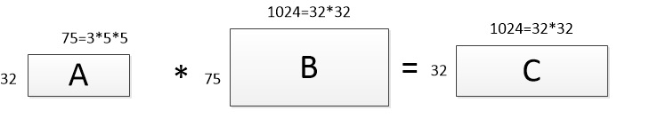

caffe源码阅读杂记
=====================================================

### 准备
*	一些参考网页
	*	[Neural Networks and Deep Learning][7]
	*	[TUTORIAL ON DEEP LEARNING FOR VISION][6]
	*	[Deep Learning Tutorial][10]
	*	[知乎-深度学习caffe的代码怎么读][9]
	*	[Caffe源码解析][15]
	*	[caffe源码结构][16]
	*	[官方代码结构doxygen][17]
	*	[官方Caffe Tutorial][5]
*	以C++源码形式配置debug&CPU版的caffe，便于阅读源码与单步调试【[参考][8]】
*	参考官方的[文档][5]，先了解某个模块的作用
*	为了简化学习，先不考虑任何与GPU相关的问题
*	我在读代码的过程中在代码中添加了一些自己的注释，代码保存在[github][19]上

### 我的阅读过程
#### 大致的过程
*	读caffe前对深度学习没有什么概念所以先通读了上面参考网页中的第一个并详细阅读了其中的network1代码，阅读过程在[这里][18]
*	大概了解几个类的结构后读了tools文件夹下的几个文件：caffe.cpp、convert_imageset.cpp、extract_features.cpp

#### Caffe中几个主要的类
*	Blob: 数据的保存与传递都使用的类(神经网络中主要的参数就是神经元之间的权值与偏置值，其均使用Blob对象保存与交互)
*	Layer: Blob数据处理方式的封装，不同layer对Blob data进行不同的运算，如卷积、池化、全连接等
*	Net: 描述网络的结构，Net中以指定的结构保存不同的Layer
*	Solver: 网络求解类，一般使用的方法是梯度下降法
#### 一些概念
*	Loss weights
	> 对于含有多个损失层的网络（例如，一个网络使用一个softMaxWithLoss 输入分类并使用EuclideanLoss 层进行重构），损失权值可以被用来指定它们之间的相对重要性。Caffe 中最终的损失函数可以通过对整个网络中所有的权值损失进行求和计算获得
#### 读caffe.proto
##### [google/protobuf][12] 简介
*	protobuf是一个数据[持久化与序列化][4]的工具，具体教程参考[1][1]、[2][2]、[官方C++版教程][3]（[C++教程国内免翻墙版][14]）。
*	**数据存储和交换**（包括通过网络交换数据） 是 Protobuf 最有效的应用领域。caffe中主要用protobuf实现网络模型的结构定义、存储和读取（网络结构映射到内存中就是对应对象之间的结构，对象初始化时需要参数。caffe使用protobuf定义内存中对象的结构并保存相应的数据，protobuf将管理这些参数在文件与内存中的映射关系，例如我们使用caffe框架是一般需要网络文件与对应的训练好的模型文件，他们是一一对应的，模型文件中保存了网络对象中的参数）。
*	使用流程如下：
	*	首先我们需要编写一个 proto 文件，定义我们程序中需要处理的结构化数据，在 protobuf 的术语中，结构化数据被称为 Message；
	*	写好 proto 文件之后就可以用 Protobuf 编译器将该文件编译成目标语言了，对于C++而言就是生成一个hpp和cpp文件；
	*	在生成的头文件中，有一个 C++ 类，使用这个类可以对消息进行操作。诸如对消息的成员进行赋值，将消息序列化、反序列化等等。
*	[proto格式说明](#proto)(见本文下方)

##### caffe.proto
*	caffe.proto中定义了很多数据结构（这些结构都会转化为对应C++类并在caffe代码中使用），数据结构的具体内容参考caffe.proto中的定义

### blob、layer、net、solver的大致结构
#### blob.hpp
*	blob类用来保存学习到的参数以及网络传输过程中产生的数据，bolb是caffe数据保存与交换的核心
*	一层一层往下分BLOB的基本元素分别为：图像->通道->行->列（这里已经是最小的元素了，其类型就是DType，常见的有float和double）。`( (n * channels() + c) * height() + h) * width() + w;`表示的是元素(n,c,h,w)在blob中的索引。
	*	`n*channels()+c `表示的是当前元素所处的通道的索引
	*	`((n * channels() + c) * height() + h)`  当前元素所处的行所在的索引
	*	最后求的就是当前元素的索引了
*	以RGB图像为例描述BLOB在内存中的格式，假设当前BLOB中有N张图，图的高为H，宽为W像素：
	
		|------------------------img0-----------------------|...img1~imgN-1...|
		|<------channel R-------> <-channel G-><-channel B->|..................
        |<row0--row2-...row(H-1)>...........................|..................
        |对应的R、或G、或B的值......
*	blob类的成员如下（部分）
	*	成员变量

			//指向存储数据的内存或显存块，一般是图像数据、权值或偏置值数据
			shared_ptr<SyncedMemory> data_;
			shared_ptr<SyncedMemory> diff_;//保存反向传递时的梯度信息
	*	成员函数

			//返回指定维度的大小，例如shape(0)返回图片的个数，shape(1)返回图片的通道数
			inline int shape(int index);
			void Reshape (const vector<int>& shape);
			//用于调整下标。C++数组不支持负数下标，当前函数的功能就是将负数转化为对应的正数下标
			inline int CanonicalAxisIndex (int axis_index) const;
			//blob中还有一些对数据进行简单计算的方法

#### SyncedMemory
*	SyncedMemory类主要用于数据在CPU和GPU之间的交换，本文不深入探索当前类。
*	SyncedMemory中的部分成员
	*	数据成员
			
			void* cpu_ptr_;
            void* gpu_ptr_;
            size_t size_;
            SyncedHead head_;
            bool own_cpu_data_;
            bool cpu_malloc_use_cuda_;
            bool own_gpu_data_;
            int device_;

	*	函数成员

			const void* cpu_data();
			void set_cpu_data (void* data);
			const void* gpu_data();
			void set_gpu_data (void* data);
			void* mutable_cpu_data();//与上面的cpu_data和gpu_data相对应，只不过内容可改
			void* mutable_gpu_data();

#### layer.hpp
*	layer是caffe中网络的基础，是基本的计算单元与连接单元。卷积、池化、內积、sigmoid等神经元运算都在layer中完成。caffe中的layer不但实现前向运算，同时也实现反向运算，即检测与训练运算都包含在同一个层中。
*	caffe中所有的层都直接或间接继承于layer这个类
*	每一层的layer从底层连接获得输入数据，计算之后通过顶层连接输出计算结果。layer对象中是不维护具体输入与输出数据的，其只是通过指针从指定的地方读取数据然后把计算后的数据写到指定的地方。
*	每一层layer都必须实现3个关键函数：setup、forward、backward
	*	Setup: 在初始化模型的的时候初始化层的参数和连接
	*	Forward: 通过底层（bottom）给出的数据计算结果并传递给顶层（top）
	*	Backward: 通过顶层(top)给出的数据计算梯度并传递给底层(bottom)。 A layer with parameters computes the gradient w.r.t. to its parameters and stores it internally.一个有参数的layer 需要计算相对于各个参数的梯度值并存储在内部。
*	forward和backward函数有对应的CPU与GPU版，如果没有定义GPU版函数，则退化使用CPU函数
*	layer类中的成员有
	*	LayerParameter是个大杂烩，每个层需要的参数都在其中有定义，只不过对于某个层不用的参数，LayerParameter中只保存其默认值（在调试的时候通过查看type_来确定层的类型）
	*	数据成员
			
			//当前层的参数，LayerParameter的结构定义在caffe.proto中
			LayerParameter layer_param_;
			Phase phase_;//用于测试还是训练，有些层只能用于测试，而有些是测试训练均可
			//指向需要训练的参数（w和b等），在卷积层中blobs_[0]保存权重信息blobs_[1]为偏置
			vector<shared_ptr<Blob<Dtype> > > blobs_;
			/** Vector indicating whether to compute the diff of each param blob. */
			vector<bool> param_propagate_down_;
			
			/** The vector that indicates whether each top blob has a non-zero weight in the objective function. */
			vector<Dtype> loss_;//损失函数值
	*	函数成员

            virtual void LayerSetUp (...);
			inline Dtype Forward (...);
            inline void Backward (...);
			//Returns the vector of learnable parameter blobs.
			vector<shared_ptr<Blob<Dtype> > >& blobs();
			//Writes the layer parameter to a protocol buffer
			virtual void ToProto (...);

#### net.hpp
*	可以说net是caffe的核心，读通了net的代码也就理解了整个caffe的运作机制，剩下的就是有选择的读层的代码。
*	net类定义了网络的结构，即各个层(layers)之间的组合（连接）方式。网络的结构在caffe中是定义在prototxt文件中的，下面以lenet网络的部分结构为例来说明（caffe中的网络层可以并列，下面使用deepid网络为例来说明）
	
		name: "LeNet"#网络结构的名称
		layer {
		  name: "data" #当前层的名称
		  type: "Input"#当前层的类型
		  top: "data"  #输出层的名称，一般每个layer都有输入与输出两个“子层”，Input层比较特殊，不用写bottom
		  input_param { shape: { dim: 64 dim: 1 dim: 28 dim: 28 } } #当前层的参数
		}
		layer {
		  name: "conv1"
		  type: "Convolution"
		  bottom: "data" #指明当前层将从“data”层获得输入数据
		  top: "conv1"   #指明输出层的名称，一般与当前层的名称相同
		  param {...     #因为篇幅，具体参数这里忽略
		}

		###################################################################
		# 以deepid网络为例，caffe中的层可以连接多个层也可以将多个层合并为一个输出
		...
		layer {
		  name: "pool3"
		  ...
		}
		# 下面两层的输入都取自pool3，且这两层的类别也不同
		layer {
		  name: "deepid_match_conv"
		  type: "Pooling"
		  bottom: "pool3" # 从pool3中获得输入数据
		  ...
		}
		layer {
		  name: "conv4"
		  type: "Convolution"
		  bottom: "pool3" # 从pool3中获得输入数据
		  ...
		}
		...
		layer {
		  name: "pool4"
		  type:  "Pooling"
		  bottom: "norm4"
		  top: "pool4"
		  ...
		}
		# 下面这一层的输入数据来自于两个层：pool4和上面的deepid_match_conv，并只有一个输出
		layer {
		  name: "deepid_concat"
		  type: "Concat"
		  bottom: "deepid_match_conv"
		  bottom: "pool4"
		  top: "deepid_concat"
		}
		...

*	net类中的成员
	*	数据成员
		
			string name; //网络的名称
			//各个层的信息
			vector<shared_ptr<Layer<Dtype> > > layers_;
			vector<string> layer_names_;
            map<string, int> layer_names_index_;
			//保存层层之间交互的信息
            vector<shared_ptr<Blob<Dtype> > > blobs_;
            vector<string> blob_names_;
            map<string, int> blob_names_index_;

	*	函数成员
		
			//前向传输，前向传输还有其他形式的函数如：ForwardFromTo、ForwardFrom等
			const vector<Blob<Dtype>*>& Forward (Dtype* loss = NULL);
			//有前向亦有反向传播函数
			void Backward();//  void BackwardFrom (int start);等形式
			//前向传输后进行反向传播并返回前向传输时的损失函数输出
			Dtype ForwardBackward();
			//设置层数据的函数
			void CopyTrainedLayersFrom (const NetParameter& param);//亦有其他形式
			//其他形式的help函数，例如ToHDF5、ToProto等

#### solver.hpp
*	solver用于训练网络（优化权值和偏置值使得损失函数的输出最小）。caffe中实现了以下几种算法用于网络的训练【[参考][20]】
	*	Stochastic Gradient Descent (type: "SGD"),
	*	AdaDelta (type: "AdaDelta"),
	*	Adaptive Gradient (type: "AdaGrad"),
	*	Adam (type: "Adam"),
	*	Nesterov’s Accelerated Gradient (type: "Nesterov") and
	*	RMSprop (type: "RMSProp")
*	SolverParameter类中的数据成员（读caffe.proto）有很多，大部分都是关于训练方法参数设置的，例如网络结构文件、学习率、迭代次数等
*	solver.hpp只是所有solver的父类，具体的solver在其他文件中
*	以lenet网络的训练solver为例说明solver需要的参数（并发全部）

		net: "./lenet_train_test.prototxt" #网络结构文件
		# 指明测试时前向传输的次数（每次batch size个样本）
		# 平均这些结果即为网络的当前对test数据集的精度
		test_iter: 100 
		test_interval: 100 # 指明进行多少次训练后进行测试
		
		base_lr: 0.01 #基本的学习率
		momentum: 0.9 #加速训练的一个参数
		weight_decay: 0.0005 #目的是正则化，降低过拟合的风险
		
		# 学习率更新的策略，一般在整个训练过程中学习率是会变化的
		lr_policy: "inv"
		gamma: 0.0001
		power: 0.75
		
		# 训练多少次显示一次信息
		# 信息中包括迭代次数、时间、当前网络对测试集与训练集的损失函数输出 
		display: 100 
		
		max_iter: 1000 #最大的训练次数，达到这个次数时caffe会停止训练并保存模型
		
		snapshot: 500 #多久保存一次当前训练模型的快照，caffe可以从指定的快照处开始训练
		snapshot_prefix: "./snapshot/lenet" # 快照文件保存的位置
		
		solver_mode: GPU #设置solver运行的模式GPU or CPU

### 典型layer代码阅读(以caffe example中的lenet为例)
##### LayerParameter
*	LayerParameter中定义了如下参数（这里只有部分，具体可参考caffe.proto文件）

		optional string name; // the layer name
		optional string type; // the layer type
		repeated string bottom; // the name of each bottom blob
		repeated string top; // the name of each top blob
		// The train / test phase for computation. 有些层只用于TEST
		optional Phase phase;
		// The blobs containing the numeric parameters of the layer.
		//BlobProto也是一种结构，同样定义在caffe.proto中，这个和blob.hpp中定义的结构不同
		//在内存中使用后者的结构，在硬盘中使用前者的结构
		repeated BlobProto blobs;
		// Rules controlling whether and when a layer is included in the network
		repeated NetStateRule include;
		repeated NetStateRule exclude;
		optional LossParameter loss_param;// Parameters shared by loss layers.
		// Layer type-specific parameters.
		optional AccuracyParameter accuracy_param;
		optional ArgMaxParameter argmax_param;
		optional BatchNormParameter batch_norm_param;
		...

##### input_layer（type：Data）
*	caffe使用LMDB作为训练数据保存与特征数据提取后存放的格式
	*	LMDB采用内存-映射文件（memory-mapped files），所以拥有非常好的I/O性能
	*	对于大型数据库（LMDB文件较大），LMDB以页缓存的形式可以不一次把全部文件写进内存中
	*	lmdb数据库是一个非关系型数据库，caffe使用LMDB数据库有以下几点原因：
		*	提高磁盘IO利用率
		*	保持数据的一致性，便于系统的解耦与维护
*	Datum类
	*	Datum是caffe保存于LMDB中的基本元素，可以认为caffe所使用的LMDB文件中保存的是Datum对象的数组
	*	Datum中包含以下几个（部分）数据成员（具体请参考caffe.proto）

			optional int32 channels = 1;//这三个参数表示图像的信息
			optional int32 height = 2;
			optional int32 width = 3;
			optional bytes data = 4;//图像的具体像素值，是个数组
			optional int32 label = 5;//当前图像所对应的类型标签
			repeated float float_data = 6;//保存特征信息的数组，一般是网络中层的数据（w&b）

##### ConvolutionLayer(caffe卷积层实现原理)
*	下面只说明我对caffe中卷积层的实现原理，具体的实现与注释请看源码。【[其他参考][21]】
*	为了说明，这里以cifar10的网络来说明caffe中卷积层的实现方法（不使用lenet是因为其为单通道）
*	caffe卷积层实现图例
	*	
		*	cifar10中conv1的参数为 `num_output`: 32 pad: 2 `kernel_size`: 5 stride: 1，上一层的参数为：(1,3,32,32)    
		*	A对应卷积层中的权重矩阵，B是由输入图像（或输入feature map）通过caffe中的`im2col_cpu`函数转化后得到的矩阵，C是输出的feature map，方框边上的数字表示二维矩阵的宽与高
		*	首先要明确一点，卷积层卷积核的个数与三个参数有关：输入层channel数、输出层channel数、`group_`值，`当前层卷积核的个数 = 输出channel数 * (输入channel数 / group_)`
		*	group_的作用是将输入通道与输出通道分组，这样输出与输入是按组对应的，即某一组内的输出只与对应组的输入有关联。caffe中的分组很简单：输入层与输出层从上到下依次分为group组，然后从上到下组与组一一对应
		*	ciafr10中conv1的group为1所以每个输出的feature map对应3个卷积核（因为输入层是一张图片的3个颜色通道），一共是`3*32 = 96`个卷积核，每个卷积核的长宽均为5，这96个卷积核一共有`96*5*5 = 2400`个参数，对应到上图中的A，A中一共有`32 * 3*5*5 = 2400`个参数 
		*	再次强调一下，当group为1时对于每一个输出通道而言其与每一个输入通道都有一个对应的卷积核，这些卷积核都将在对应的输入通道中进行卷积运算，所有属于一个feature map的卷积核每滑动一次生成一个feature map中的一个像素点（对这些卷积核的输出求和就得到了一个标量）。以cifar10中conv1为例，B是75行，即上25行源自第一个通道，中间25行源自第二个通道，最后一行源自最后一个通道。B是1024列，因为每一个feature map都有1024个像素，即每一个卷积核都要滑动1024次。B的第一行是所有在第一个输入通道做卷积操作的卷积核的第一行的第一个元素对应在输入通道的像素，第二行是这些卷积核第一行的第二个元素对应在输入通道的像素...，当一个通道的卷积核滑动完成后就是下一个通道
		*	C中的每一行都是一个feature map
		*	具体参考可以看本节的[其他参考][21]，详细的细节可以看源码。没有图不好解释，所以这里只记录了我的一些理解。

### proto详解
*	proto [格式示例与解释][13]

		syntax = "proto2";//指明所使用的协议版本号
		
		//名字空间，自动生成代码时所有代码均在这个名字空间内，在C++中会像这样：namespace tutorial {...}
		package tutorial;
		
		//结构化数据被称为 Message
		//在hpp文件中会生成如下类和结构：
		//enum Person_PhoneType;
		//class Person_PhoneNumber : public ::google::protobuf::Message;
		//class Person :public ::google::protobuf::Message;
		//class AddressBook : public ::google::protobuf::Message;
		message Person {
		  
		  // 字段（类成员）定义格式：限定修饰符① | 数据类型② | 字段名称③ | = | 字段编码值④ | [字段默认值⑤]
          // 每一个变量前都需要使用下面三个词进行修饰：required、optional、repeated
		  // required表示是一个必须字段，必须相对于发送方（对应于数据的序列化方），在发送消息之前必须设置该字段的值，
		  // 对于接收方（对应于数据的反序列化方），必须能够识别该字段的意思。
		  // 发送之前没有设置required字段或者无法识别required字段都会引发编解码异常，导致消息被丢弃。
		  required string name = 1;

		  // 这里的数值"=1、=2..."是编码值，编码值用于通信双方互相识别对方的字段
          // 其中 1~15的编码时间和空间效率都是最高的，编码值越大，其编码的时间和空间效率就越低
		  // 1900~2000编码值为Google protobuf 系统内部保留值，建议不要在自己的项目中使用
		  required int32 id = 2;

		  // optional表示是一个可选字段，可选对于发送方，在发送消息时，可以有选择性的设置或者不设置该字段的值
		  // 对于接收方，如果能够识别可选字段就进行相应的处理，如果无法识别，则忽略该字段，消息中的其它字段正常处理
		  // 项目投入运营以后涉及到版本升级时的新增消息字段全部使用optional或者repeated，尽量不使用required
		  // 如果使用了required，需要全网统一升级，如果使用optional或者repeated可以平滑升级

		  optional string email = 3;
		  // Repeated：表示该字段可以包含0~N个元素。
		  // 其特性和optional一样，但是每一次可以包含多个值。可以看作是在传递一个数组的值。
		  repeat string phones;
		  enum PhoneType {
		    MOBILE = 0;
		    HOME = 1;
		    WORK = 2;
		  }
		
		  message PhoneNumber {
		    required string number = 1;
		    optional PhoneType type = 2 [default = HOME];
		  }
		
		  // 表示该字段可以包含0~N个元素。其特性和optional一样，但是每一次可以包含多个值
		  // 可以看作是在传递一个数组的值
		  repeated PhoneNumber phones = 4;
		}
		
		message AddressBook {
		  repeated Person people = 1;
		}

*	The Protocol Buffer API（通过 Protobuf 编译器编译上面的proto文件所获得的）
	*	示例指令：`protoc -I=$SRC_DIR --cpp_out=$DST_DIR $SRC_DIR/addressbook.proto`

		// name
		inline bool has_name() const;//判断信息中是否包含当前元素
		inline void clear_name();
		inline const ::std::string& name() const;//下面是getter和setter
		inline void set_name(const ::std::string& value);
		inline void set_name(const char* value);
		inline ::std::string* mutable_name();
		
		...

*	Writing A Message & Reading A Message（使用上面API的示例）
	
		//create Message 
		cout << "Enter person ID number: ";
		int id;
		cin >> id;
		person->set_id(id);
		cin.ignore(256, '\n');
		
		cout << "Enter name: ";
		getline(cin, *person->mutable_name());
		...

		//read massage
		cout << "Person ID: " << person.id() << endl;
		cout << "  Name: " << person.name() << endl;
		if (person.has_email()) {
			cout << "  E-mail address: " << person.email() << endl;
		}

[1]:https://www.ibm.com/developerworks/cn/linux/l-cn-gpb/
[2]:http://blog.csdn.net/majianfei1023/article/details/45112415
[3]:https://developers.google.com/protocol-buffers/docs/cpptutorial
[4]:https://www.zhihu.com/question/20706270
[5]:http://caffe.berkeleyvision.org/tutorial/
[6]:https://sites.google.com/site/deeplearningcvpr2014/
[7]:http://neuralnetworksanddeeplearning.com/index.html
[8]:http://www.cnblogs.com/jiahu-Blog/p/6423962.html
[9]:https://www.zhihu.com/question/27982282
[10]:http://deeplearning.net/tutorial/deeplearning.pdf
[11]:http://alanse7en.github.io/caffedai-ma-jie-xi-1/
[12]:http://www.lxway.com/905144802.htm
[13]:http://blog.csdn.net/guyue35/article/details/51181845
[14]:http://blog.csdn.net/sunlylorn/article/details/7598295
[15]:http://www.cnblogs.com/louyihang-loves-baiyan/p/5149628.html
[16]:https://www.leiphone.com/news/201612/oZUj5d437bpSl5wc.html
[17]:http://caffe.berkeleyvision.org/doxygen/
[18]:http://www.cnblogs.com/jiahu-Blog/p/7847043.html
[19]:https://github.com/HJiahu/learn_caffe_src
[20]:http://caffe.berkeleyvision.org/tutorial/solver.html
[21]:http://blog.csdn.net/jiongnima/article/details/69055941